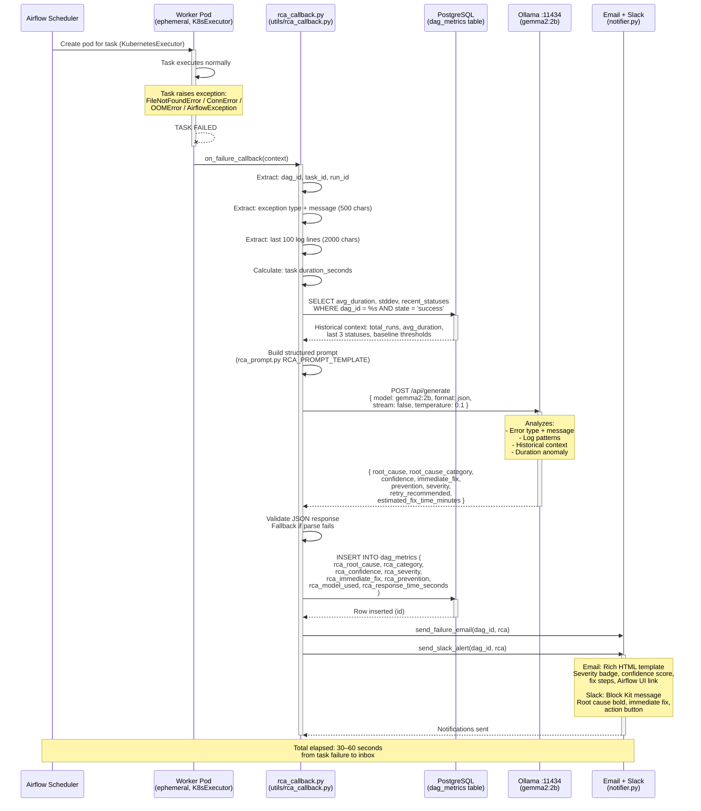
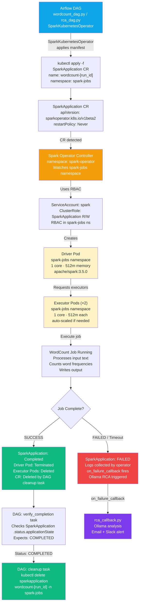
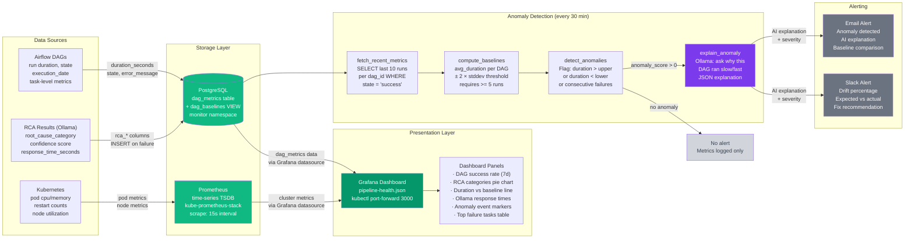

# Flow Diagrams — Airflow + Spark + Ollama RCA PoC

Four Mermaid diagrams covering every major data and control flow in the PoC.
Render these in any Mermaid-compatible viewer (GitHub, VS Code with Mermaid extension, mermaid.live).

---

## Diagram 1: Model Acquisition Flow

How the gemma2:2b model gets from HuggingFace into the cluster and becomes a live API endpoint.

```mermaid
flowchart LR
  HF["🤗 HuggingFace Registry\ngemma2:2b model\n(hosted externally)"]
  OD["Ollama Pod\nllm-serving namespace\nollama/ollama:latest"]
  PVC["30GB PersistentVolume\n/root/.ollama/models\ngemma2:2b — 1.6 GB on disk"]
  SERVE["Model Serving Engine\nAPI: 0.0.0.0:11434\nTemp: 0.1 · Max tokens: 512"]
  SVC["ollama-service (ClusterIP)\nport 11434\nNetworkPolicy: airflow ns only"]
  NP["NetworkPolicy\nIngress: from namespace=airflow\nEgress: blocked externally"]

  HF -->|"ollama pull gemma2:2b\none-time setup only"| OD
  OD -->|"Persisted to PVC\nsurvives pod restarts"| PVC
  PVC -->|"Loaded into memory\non pod start"| SERVE
  SERVE -->|"Bound to ClusterIP\nport 11434"| SVC
  SVC -->|"Protected by"| NP

  style HF fill:#FF6B35,color:#fff
  style OD fill:#7C3AED,color:#fff
  style PVC fill:#8B5CF6,color:#fff
  style SERVE fill:#7C3AED,color:#fff
  style SVC fill:#6D28D9,color:#fff
  style NP fill:#EF4444,color:#fff
```



---

## Diagram 2: DAG Failure → RCA Complete Flow

Full sequence from task failure to RCA email landing in inbox — target: 30–60 seconds total.



---

## Diagram 3: Ephemeral Spark Job Flow

How Airflow triggers a Spark job and how the SparkApplication lifecycle ensures full cleanup.



---

## Diagram 4: Observability and Anomaly Detection Flow

How raw run data becomes actionable alerts through baseline computation and drift detection.



---

## Quick Reference — Namespace and Port Map

| Namespace | Component | Internal Port | Access |
|---|---|---|---|
| `airflow` | Webserver | 8080 | `kubectl port-forward svc/airflow-webserver 8080:8080` |
| `airflow` | Scheduler | — | Internal only |
| `llm-serving` | Ollama | 11434 | ClusterIP only (from airflow ns) |
| `spark-operator` | Controller | 8080 (webhook) | Internal only |
| `spark-jobs` | Driver/Executors | ephemeral | Deleted post-completion |
| `monitoring` | PostgreSQL | 5432 | Internal only |
| `monitoring` | Prometheus | 9090 | `kubectl port-forward svc/prometheus 9090:9090` |
| `monitoring` | Grafana | 3000 | `kubectl port-forward svc/grafana 3000:3000` |

---

## RCA Data Flow Summary

```
Task FAILS
    │
    ▼  on_failure_callback (synchronous, same worker pod)
    │
    ├─► Collect context (logs, error, duration, run history)
    │
    ├─► Build prompt (rca_prompt.py RCA_PROMPT_TEMPLATE)
    │       Includes: dag_id, task_id, error_type, error_message,
    │                 log_excerpt (2000 chars), historical stats
    │
    ├─► POST ollama-service.llm-serving.svc.cluster.local:11434/api/generate
    │       model: gemma2:2b
    │       format: json (forces structured output)
    │       temperature: 0.1 (deterministic)
    │       timeout: 120s
    │
    ├─► Parse JSON response → validate all required keys
    │
    ├─► INSERT INTO dag_metrics (all rca_* columns)
    │
    ├─► send_failure_email → smtp.gmail.com:587 (HTML template)
    │
    └─► send_slack_alert  → Incoming Webhook (Block Kit)

Total wall-clock time: 30–60 seconds
```

---

*Generated for poc-airflow-spark-ollama — GKE + Airflow + Spark + Ollama RCA PoC*
*Architecture mirrors enterprise GDC deployment pattern*
